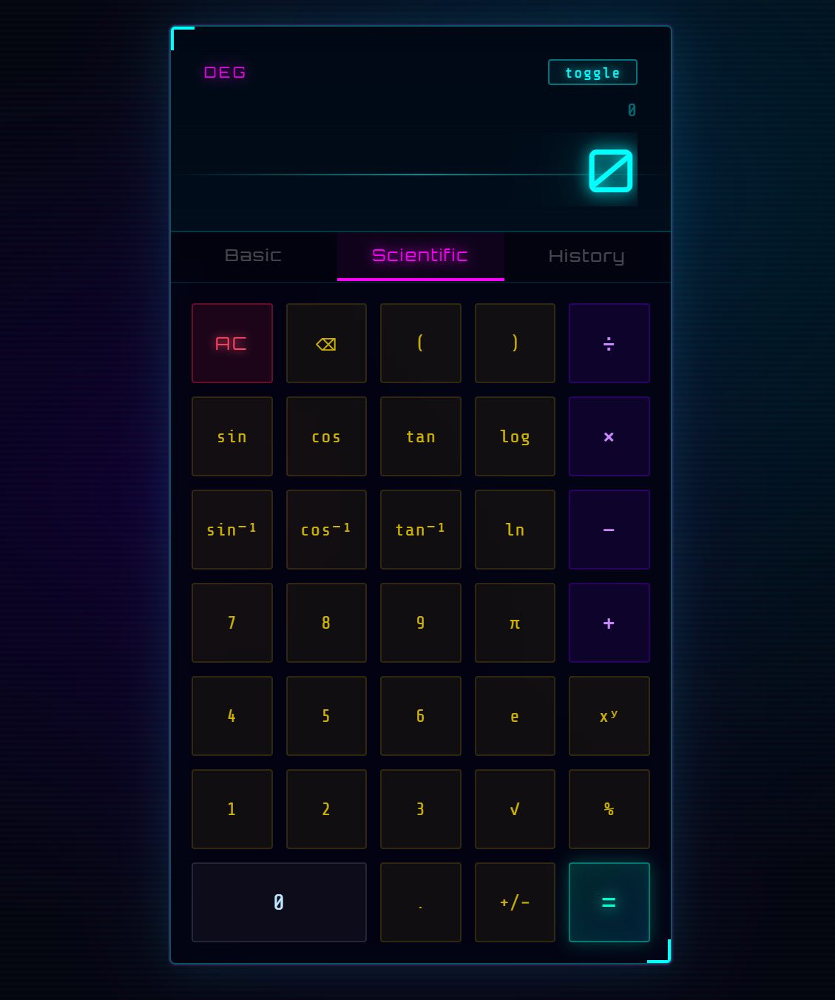

#  synthcalc
 
Kalkulator saintifik bertema neon dengan estetika cyberpunk, dibangun dengan HTML, CSS, dan JavaScript murni.
 

 
---
 
##  Fitur
 
- **Mode Dasar & Saintifik**, trigonometri, logaritma, invers trigonometri, konstanta (π, e), akar kuadrat, dan perpangkatan
- **Tampilan neon cyberpunk**, layar glowing, animasi scanline, font Orbitron + Share Tech Mono
- **Riwayat perhitungan**, 30 hasil terakhir tersimpan, ketuk salah satu untuk memanggilnya kembali
- **Toggle DEG / RAD**, ganti satuan sudut kapan saja
- **Perkalian otomatis**, mengetik `sin(30)2` otomatis menjadi `sin(30)*2`, tidak perlu `×` manual
- **Dukungan keyboard**, bisa dioperasikan penuh tanpa mouse
- **Responsif**, bisa dipakai di desktop maupun ponsel
---
 
##  Cara Menjalankan
 
Tidak perlu build tool atau dependensi apapun. Cukup clone dan buka.
 
```bash
git clone https://github.com/fitri-hub/synthcalc.git
cd synthcalc
```
 
Lalu buka file `index.html` di browser — selesai.
 
---
 
##  Struktur File
 
```
synthcalc/
├── index.html      # Markup & tampilan
├── style.css       # Gaya neon cyberpunk
└── script.js       # Logika kalkulator
```
 
---
 
##  Pintasan Keyboard
 
| Tombol | Fungsi |
|--------|--------|
| `0–9` | Input angka |
| `+ - * /` | Operator |
| `.` | Titik desimal |
| `Enter` atau `=` | Hitung |
| `Backspace` | Hapus karakter terakhir |
| `Escape` | Hapus semua (AC) |
 
---
 
##  Fungsi Saintifik
 
| Tombol | Fungsi |
|--------|--------|
| `sin` `cos` `tan` | Trigonometri (DEG atau RAD) |
| `sin⁻¹` `cos⁻¹` `tan⁻¹` | Invers trigonometri |
| `log` | Logaritma basis 10 |
| `ln` | Logaritma natural |
| `√` | Akar kuadrat |
| `xʸ` | Perpangkatan |
| `π` `e` | Konstanta matematika |
| `%` | Persentase (÷ 100) |
 
---
 
##  Font yang Digunakan
 
- [Orbitron](https://fonts.google.com/specimen/Orbitron) — layar & label
- [Share Tech Mono](https://fonts.google.com/specimen/Share+Tech+Mono) — tombol & riwayat
Keduanya dimuat via Google Fonts (membutuhkan koneksi internet saat pertama kali dibuka).
 
---
 
##  Dibangun Dengan
 
- HTML5
- CSS3 (animasi keyframe, CSS variables, efek glassmorphism)
- JavaScript murni (tanpa framework, tanpa dependensi)
---
